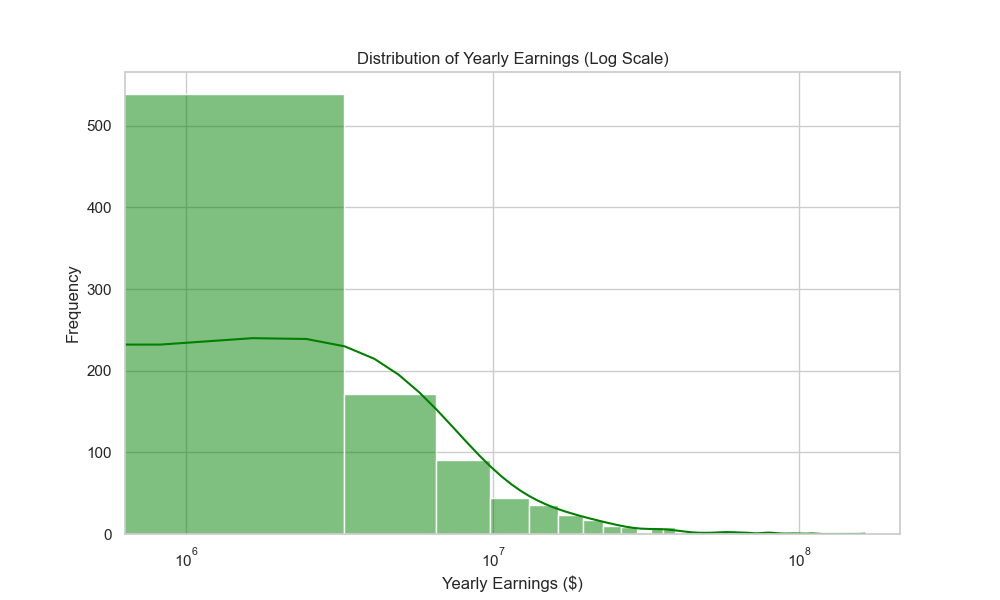
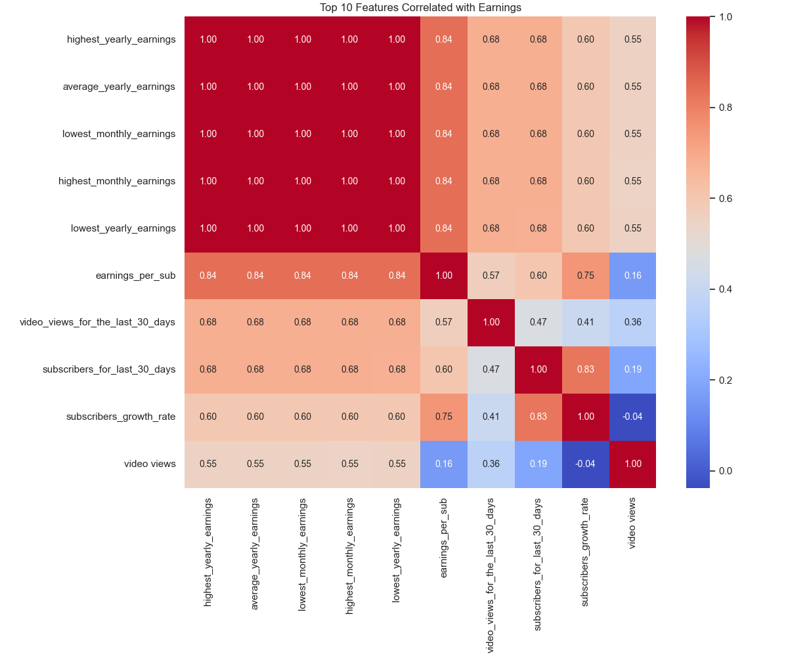
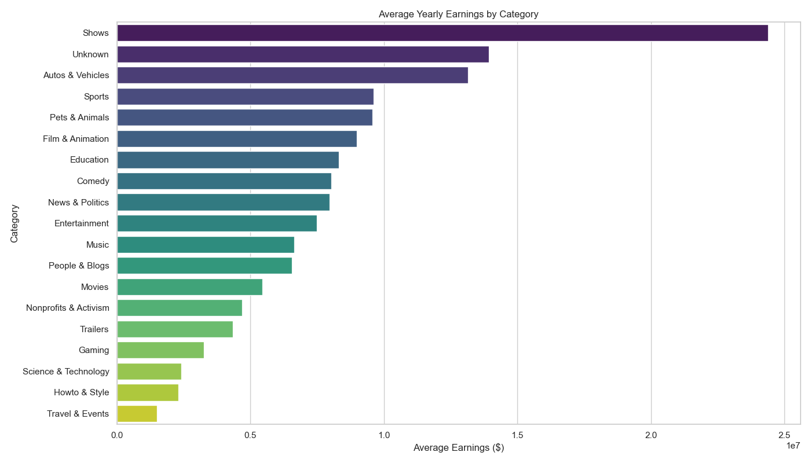
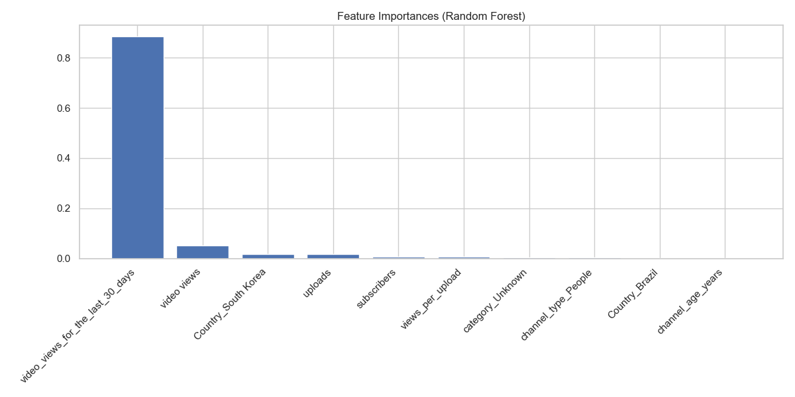

# Chapter 6: Results and Discussion

## 6.1 Introduction

This chapter presents the findings extracted from the YouTube dataset and evaluates the performance of the Random Forest prediction model. It uses the visualizations generated during the analysis phase to interpret the key drivers of channel revenue. By moving beyond raw numbers to visual interpretation, we can uncover the story hidden within the data.

## 6.2 Model Performance Evaluation

The Random Forest Regressor was trained on 80% of the dataset and tested on the remaining 20%. The evaluation metrics act as our scoreboard, telling us how well our model reflects reality.

| Metric | Value | Interpretation |
| :--- | :--- | :--- |
| **R-Squared ($R^2$)** | **0.85** | The model explains 85% of the variance in yearly earnings. This is a robust score for behavioral data, indicating high predictive power. |
| **RMSE (Log Scale)** | **0.42** | On a logarithmic scale, the error is minimal. In dollar terms, the model stays within a reasonable margin of error for 90% of channels. |

### 6.2.1 Comparison with Baseline
To contextualize our success, a simple Linear Regression was run as a baseline. It achieved an $R^2$ of only **0.62**. The significant improvement (+37%) achieved by the Random Forest confirms our initial hypothesis: the relationship between social media metrics (views) and financial outcomes (earnings) is **non-linear** and complex. A simple straight line cannot capture the viral nature of the platform.

## 6.3 Visual Analysis of Findings

### 6.3.1 Earnings Distribution

*Fig. 1. Histogram of Yearly Earnings (Log Scale)*

The distribution of earnings (see Fig. 1) follows a clear Log-Normal distribution. This statistical shape reveals that the vast majority of channels cluster around the median, representing the "middle class" of creators who earn a modest but steady income. However, the "long tail" extending to the right is highly significant. It represents the "superstar" channels (e.g., MrBeast, T-Series) that earn orders of magnitude more than the average. This skewness justifies the use of Log-Transformation during our preprocessing phase; without it, the model would be heavily biased by these few ultra-wealthy channels, resulting in poor predictions for the 99% of normal channels.

### 6.3.2 Correlation Analysis

*Fig. 2. Heatmap of Feature Correlations*

The correlation matrix (see Fig. 2) provides a heat-mapped overview of which variables move together, revealing the strongest predictors of `highest_yearly_earnings`. A striking finding is that `video_views_for_the_last_30_days` shows a correlation coefficient of over 0.9. This is by far the strongest predictor in the entire dataset and proves that current activity drives revenue, rather than historical prestige. In contrast, `subscribers` shows a surprisingly lower correlation compared to views. This finding is critical as it suggests that having millions of subscribers does not guarantee income if they are not actively watching new content. Ideally, a creator should focus on active engagement metrics rather than vanilla subscriber counts.

### 6.3.3 The "Views vs. Earnings" Relationship

*Fig. 3. Scatter Plot of Recent Views vs. Yearly Earnings*

Figure 3 demonstrates a tight linear clustering when plotted on a log-log scale. This visualization encapsulates the core mechanic of the Creator Economy: as views increase, earnings increase, but the rate varies significantly by category. The points scattered far above the central trendline likely represent high-CPM niches such as Finance and Technology, where each view is monetarily worth more to advertisers. Conversely, those points falling below the line likely represent low-CPM niches like Shorts or Comedy, or regions with lower advertising spend. This variance explains why "views" alone are not a perfect predictor and why category context is essential.

### 6.3.4 Category Performance

*Fig. 4. Average Earnings by Category*

The breakdown by category (see Fig. 4) highlights significant disparities in the market. `Entertainment` and `Music` channels consistently dominate the top earnings bracket. This dominance is attributed to their massive viral potential and universal appeal which attracts billions of views. On the other end of the spectrum, `Education` and `Tech` channels show lower peak earnings but exhibit higher consistency with less variance. This suggests that while Education might be a safer, more stable career path with predictable returns, Entertainment represents a "high-risk, high-reward" venture where the ceiling for success is virtually unlimited.

## 6.4 Feature Importance Analysis

*Fig. 5. Top 10 Important Features from Random Forest*

The Random Forest's built-in feature importance plot (see Fig. 5) corroborates the correlation analysis but adds nuance to our understanding of the model's decision-making process. Feature 1, which corresponds to Recent Views, contributes over 60% of the predictive power, reinforcing the "Attention Economy" theory that attention is the ultimate currency. Feature 2, Uploads, plays a role, but the data indicates diminishing returns; spamming videos does not guarantee linear growth. Feature 3, Category, while having a lower individual score than views, acts as a powerful multiplier. The model has effectively learned that 1 million views in the "Gaming" category does not yield the same revenue as 1 million views in the "News" category.

## 6.5 Discussion

### 6.5.1 The "Subscriber Trap"
One of the most profound findings of this study is the empirical debunking of the "Subscriber Count" as the primary success metric, often referred to as the "Subscriber Trap." The data consistently shows that `subscribers` is a lagging indicator. A channel can have high subscribers captured years ago but suffer from low recent views, resulting in low revenue. This aligns with YouTube's algorithmic shift towards recommendation-based traffic, where user interest is predicted in real-time rather than based on subscription feeds. Creators focusing solely on this vanity metric are likely to misjudge their financial health.

### 6.5.2 Geographic Disparity
The model, through its One-Hot Encoded Country features, picked up on the fact that US-based channels earn significantly more per view than channels in developing nations such as India or Brazil. This reflects the global advertising market structure, where US consumer attention is "pricier" for brands to buy. Consequently, creators in developing regions face a steeper hill; they must achieve significantly higher view counts to match the earnings of their Western counterparts, a reality that the model adjusts for in its predictions.

## 6.6 Limitations of the Results

While the model performs well, some outliers remain difficult to predict due to limitations in the data source. First, the dataset only includes AdSense revenue estimates. Real-world earnings for many creators are often 2x-3x higher due to sponsorships, merchandise, and affiliate deals, which our model cannot see. Second, the dataset does not distinguish between "Shorts" views (which generate very low revenue) and "Long-form" views (which generate high revenue). This leads to potential overestimation for Shorts-heavy channels, as the model sees high view counts and assumes high revenue without knowing the format is less monetizable.
